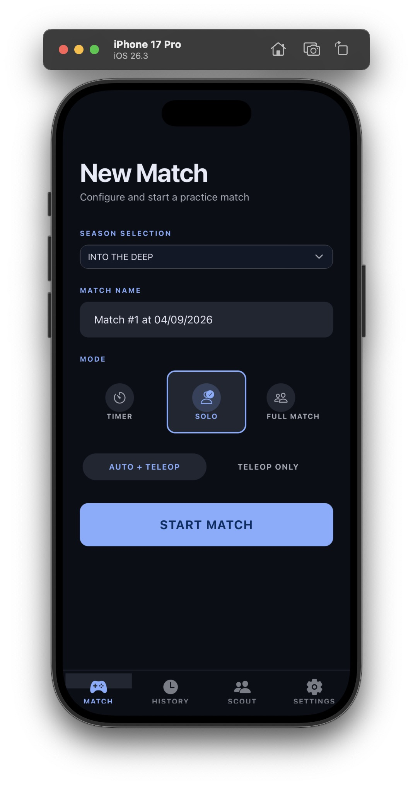
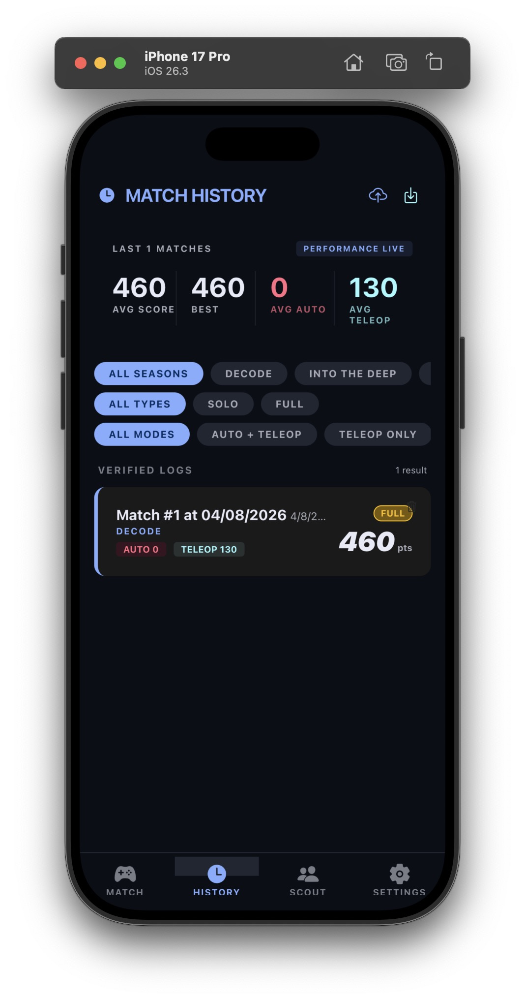
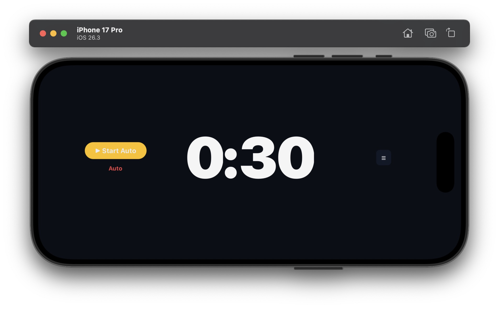
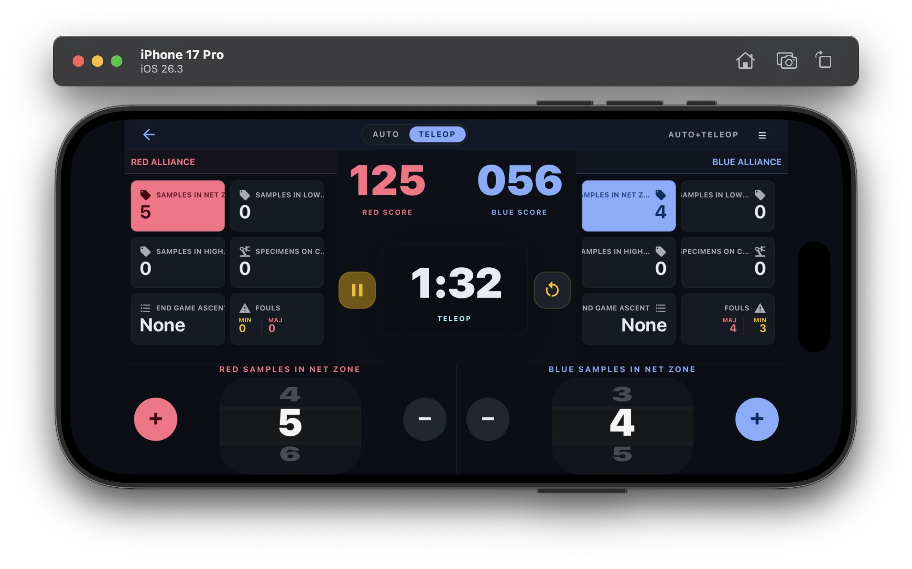

# FTCUltimate

A React Native + Expo app for FTC/FRC practice match logging and scouting.

> **Warning:** This app is still in active development. Major bugs are known to exist — use at your own risk.

## Screenshots

<p float="left">
  
  &nbsp;&nbsp;
  
</p>

<p>
  
</p>

<p>
  
</p>

## Features

- **Multi-mode scoring** — Timer only, Solo, or Full Match (two alliances)
- **Season config** — drop a JSON file in `seasons/` to add a new season, no code changes needed
- **Match history** — filter by season, type, and mode; view avg/best scores
- **Local + cloud sync** — WatermelonDB (SQLite) locally, Supabase for cloud backup

## Setup

```bash
cd FTCUltimate
npm install
cp .env.example .env   # fill in Supabase credentials
npx expo run:ios       # or run:android — Expo Go not supported (WatermelonDB JSI)
```

## Tech Stack

- React Native + Expo (file-based routing via Expo Router)
- WatermelonDB (JSI/SQLite) for local persistence
- Supabase for cloud sync
- Zustand for state management
- NativeWind (Tailwind) for styling
